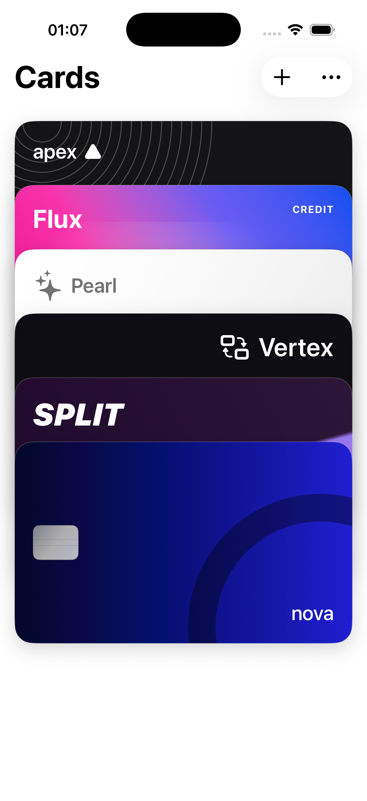
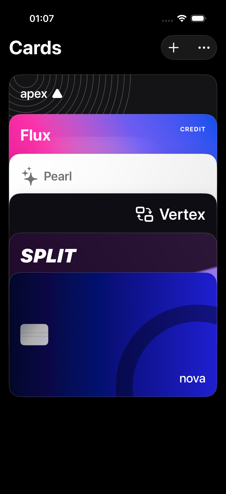
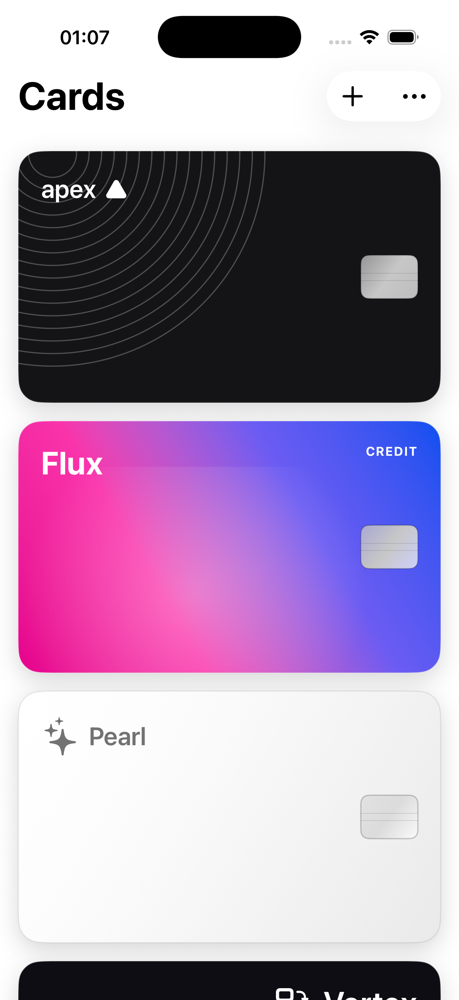
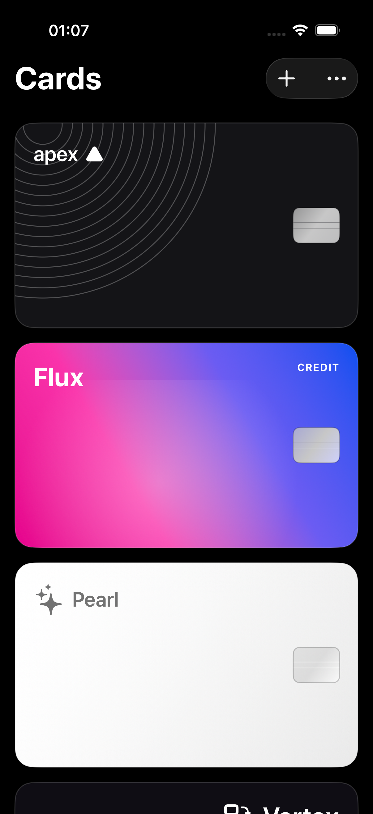
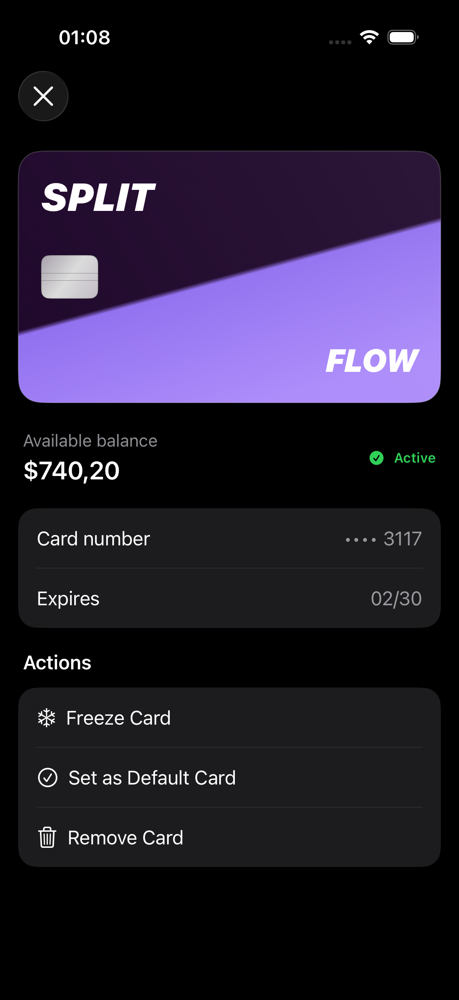

<p align="center">
  
</p>

<h1 align="center">CardWallet</h1>

<p align="center">
  A SwiftUI card-management experience with fluid wallet-style interactions, persistent state, dependency injection, and tested edge-case handling.
</p>

<p align="center">
  SwiftUI · SwiftData · Observation · Swift Testing
</p>

<p align="center">
  <a href="https://github.com/aishamadalieva/card-wallet-ios/actions/workflows/ci.yml">
    
  </a>
</p>

## Overview

CardWallet is an iOS portfolio project focused on combining polished interaction design with maintainable application architecture. Cards can be browsed as an overlapping stack or a list, selected through a fluid transition, and managed from a focused details screen.

The project uses original card designs and synthetic data. It does not connect to payment networks or store complete payment credentials.

## Demo

- [Card selection and details](Documentation/Media/card-selection.mov)
- [Add a card](Documentation/Media/add-card.mov)
- [Remove a card](Documentation/Media/remove-card.mov)

## Interface

### Stack layout

<p align="center">
  
  
</p>

### List layout and card details

<p align="center">
  
  
  
</p>

## Features

- Fluid card-stack expansion, selection, and collapse
- Stack and list presentation modes
- Persistent add, freeze, default-card, and remove actions
- Luhn card-number validation with real-time input formatting
- Expiration-date and security-code validation
- Shimmer loading placeholders for cards and card details
- Recoverable loading, empty, and error states
- Confirmation alerts and contextual success or failure feedback
- Light and dark appearance support
- Optimistic card removal with rollback if persistence fails

## Architecture

The UI depends on abstractions rather than persistence details. Dependencies are assembled once and injected into feature view models.

```text
SwiftUI Views
     │
     ▼
Observable View Models
     │
     ▼
CardRepositoryProtocol
     │
     ▼
SwiftDataCardRepository
     │
     ▼
@ModelActor Store ──► SwiftData
```

- **UI:** focused SwiftUI views and reusable shimmer/toast components
- **Presentation:** `@Observable` view models own screen state and user actions
- **Domain boundary:** `CardRepositoryProtocol` isolates features from storage
- **Data:** a SwiftData repository maps persistent entities to domain models
- **Concurrency:** the SwiftData store is isolated with `@ModelActor`
- **Dependency injection:** app and feature assemblies construct concrete dependencies

## Data and privacy

Only display-safe card data is persisted, including the last four digits, expiration date, status, order, and default-card selection. Full card numbers and security codes are validated in memory and are never written to SwiftData.

All bundled card names and balances are fictional. This project is a UI and architecture demonstration, not a payment product.

## Testing

The test target uses Swift Testing and currently covers 24 executed cases across:

- Card-number, expiration-date, and security-code validation
- Input normalization and formatting
- SwiftData seeding and persistence behavior
- Status and default-card updates
- Primary-card replacement after removal
- View-model loading and error states
- Failed-action rollback behavior

Run the suite from Xcode with **Product → Test**, or from the command line:

```sh
xcodebuild \
  -project CardFlow.xcodeproj \
  -scheme CardFlow \
  -destination 'platform=iOS Simulator,name=iPhone 17' \
  test
```

## Requirements

- Xcode 26.2 or later
- iOS 26.2 or later
- No third-party dependencies

## Getting started

1. Clone the repository.
2. Open `CardFlow.xcodeproj`.
3. Select an iPhone simulator running iOS 26.2 or later.
4. Build and run the `CardFlow` scheme.

Use the following synthetic card when testing the add-card flow:

```text
Card number: 4242 4242 4242 4242
Expiration:  12/30
CVV:         123
```

## License

CardWallet is available under the [MIT License](LICENSE).
